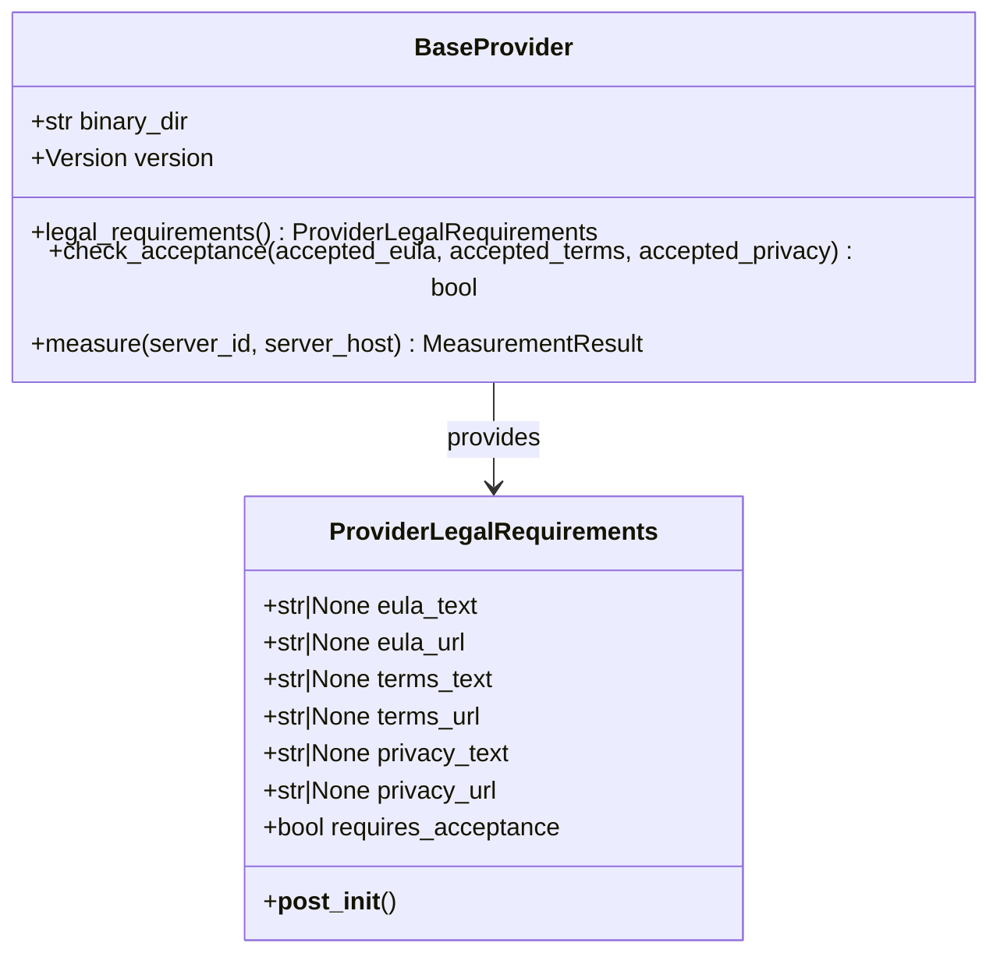
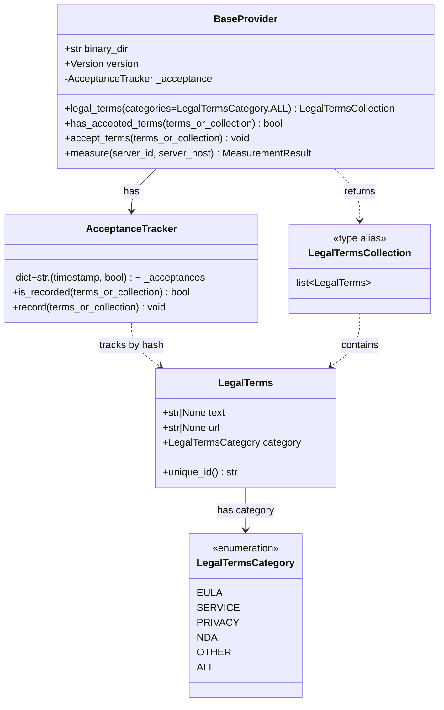
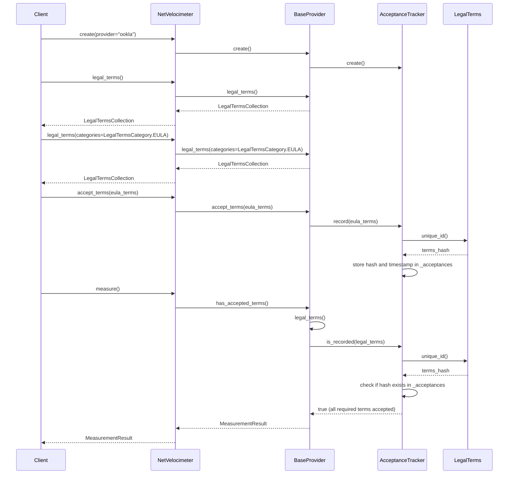

# NetVelocimeter

## Current model

```mermaid

classDiagram
    class ProviderLegalRequirements {
        +str|None eula_text
        +str|None eula_url
        +str|None terms_text
        +str|None terms_url
        +str|None privacy_text
        +str|None privacy_url
        +bool requires_acceptance
        +__post_init__()
    }

    class BaseProvider {
        +str binary_dir
        +Version version
        +legal_requirements() ProviderLegalRequirements
        +check_acceptance(accepted_eula, accepted_terms, accepted_privacy) bool
        +measure(server_id, server_host) MeasurementResult
    }

    BaseProvider --> ProviderLegalRequirements : provides

```

## New improved

### Model

```mermaid

classDiagram
    class LegalTerms {
        +str|None text
        +str|None url
        +LegalTermsCategory category
        +unique_id() str
    }

    class LegalTermsCategory {
        <<enumeration>>
        EULA
        SERVICE
        PRIVACY
        NDA
        OTHER
        ALL
    }

    class LegalTermsCollection {
        <<type alias>>
        list~LegalTerms~
    }

    class AcceptanceTracker {
        -dict~str, (timestamp, bool)~ _acceptances
        +is_recorded(terms_or_collection) bool
        +record(terms_or_collection) void
    }

    class BaseProvider {
        +str binary_dir
        +Version version
        -AcceptanceTracker _acceptance
        +legal_terms(categories=LegalTermsCategory.ALL) LegalTermsCollection
        +has_accepted_terms(terms_or_collection) bool
        +accept_terms(terms_or_collection) void
        +measure(server_id, server_host) MeasurementResult
    }

    LegalTerms --> LegalTermsCategory : has category
    BaseProvider ..> LegalTermsCollection : returns
    BaseProvider --> AcceptanceTracker : has
    AcceptanceTracker ..> LegalTerms : tracks by hash
    LegalTermsCollection ..> LegalTerms : contains

```

### Interaction flow

```mermaid

sequenceDiagram
    participant Client
    participant NetVelocimeter
    participant Provider as BaseProvider
    participant Tracker as AcceptanceTracker

    Client->>NetVelocimeter: create(provider="ookla")
    NetVelocimeter->>Provider: create()
    Provider->>Tracker: create()

    Client->>NetVelocimeter: legal_terms()
    NetVelocimeter->>Provider: legal_terms()
    Provider-->>NetVelocimeter: LegalTermsCollection
    NetVelocimeter-->>Client: LegalTermsCollection

    Client->>NetVelocimeter: legal_terms(categories=LegalTermsCategory.EULA)
    NetVelocimeter->>Provider: legal_terms(categories=LegalTermsCategory.EULA)
    Provider-->>NetVelocimeter: LegalTermsCollection
    NetVelocimeter-->>Client: LegalTermsCollection

    Client->>NetVelocimeter: accept_terms(eula_terms)
    NetVelocimeter->>Provider: accept_terms(eula_terms)
    Provider->>Tracker: record(eula_terms)
    Tracker->>LegalTerms: unique_id()
    LegalTerms-->>Tracker: terms_hash
    Tracker->>Tracker: store hash and timestamp in _acceptances

    Client->>NetVelocimeter: measure()
    NetVelocimeter->>Provider: has_accepted_terms()
    Provider->>Provider: legal_terms()
    Provider->>Tracker: is_recorded(legal_terms)
    Tracker->>LegalTerms: unique_id()
    LegalTerms-->>Tracker: terms_hash
    Tracker->>Tracker: check if hash exists in _acceptances
    Tracker-->>Provider: true (all required terms accepted)
    Provider-->>NetVelocimeter: MeasurementResult
    NetVelocimeter-->>Client: MeasurementResult

```
